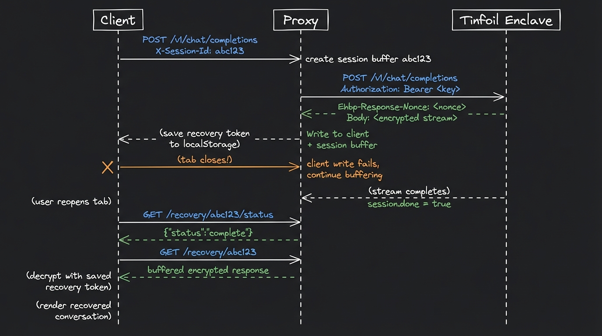

# Session Recovery Example

[](https://docs.tinfoil.sh/guides/proxy-server)

This example demonstrates **session recovery** for encrypted AI streaming responses. If a user closes their browser tab while a response is streaming, the proxy continues buffering the encrypted response. When the user reopens the page, the client retrieves and decrypts the buffered response.

This builds on the basic encrypted request proxy pattern shown in [encrypted-request-proxy-example](../encrypted-request-proxy-example) and described in [our docs](https://docs.tinfoil.sh/guides/proxy-server).

## Project Structure

```
├── server/
│   └── main.go              # Go proxy server with session buffering
└── clients/
    └── typescript/          # Browser chat client with recovery
```

## Quick Start

```bash
# Terminal 1: Start the proxy
export TINFOIL_API_KEY=<YOUR_API_KEY>
cd server && go run main.go

# Terminal 2: Start the TypeScript client
cd clients/typescript && npm install && npx vite
```

Open http://localhost:5173 and send a message.

## Prerequisites

- Go 1.21+
- Node.js 18+
- A Tinfoil API key

## How It Works

Streaming responses can take several seconds. If the user closes the tab mid-stream, the response is lost and the client cannot recover at a later point in time. Session recovery solves this by having the proxy buffer a copy of the encrypted response from the secure enclave. 
The proxy does not decrypt the response, it simply stores the stream in a table and finishes serving it to the client 
at a later point in time. If the client saved the session state (e.g., in localStorage) then it will be able to 
request and recover the stream at any future point in time. 

**Before streaming starts:**
1. Client generates a random session ID and sends it via the `X-Session-Id` header
2. Proxy creates an buffer (in our case the buffer is in-memory but it can be a database) for that session and writes the encrypted response from the secure enclave into it.  
3. The client extracts a 64-byte recovery token (the HPKE exported secret + request enc) from the active encryption context and saves it to `localStorage` along with the session ID. 

**If the tab closes mid-stream:**
The proxy detects the client disconnect but keeps the upstream enclave connection alive (using a background context) and continues buffering the response. 

**When the user reopens the page:**
4. The client finds the recovery token in `localStorage` and polls `GET /recovery/{id}/status`
5. Once the proxy reports the session is `complete`, the client fetches the full buffered response from `GET /recovery/{id}`
7. Client reconstructs the session token from `localStorage` and calls `SecureClient.decryptRecoveryResponse()` to decrypt the buffered response
8. The decrypted response is streamed through the same SSE parser and rendered in the chat UI

The client sends `DELETE /recovery/{id}` after a successful normal completion to clean up the buffer.

## Endpoints

| Path | Method | Description |
|------|--------|-------------|
| `/v1/chat/completions` | POST | Forwards encrypted request to the enclave, buffers response if `X-Session-Id` is set |
| `/v1/responses` | POST | Same as above |
| `/attestation` | GET | Proxies attestation bundles from `https://atc.tinfoil.sh/attestation` |
| `/recovery/{id}/status` | GET | Returns `{"status": "not_found\|in_progress\|complete", "bytes": N}` |
| `/recovery/{id}` | GET | Returns the buffered encrypted response (once complete) |
| `/recovery/{id}` | DELETE | Removes the session buffer |

## Headers

| Direction | Header | Purpose |
|-----------|--------|---------|
| Request | `X-Session-Id` | Enables response buffering for recovery |
| Request | `X-Tinfoil-Enclave-Url` | Enclave URL the client verified — used as upstream target |
| Request | `Ehbp-Encapsulated-Key` | HPKE encapsulated key for the enclave to decrypt the request |
| Response | `Ehbp-Response-Nonce` | Nonce for the client to decrypt the response |

## Request Flow


